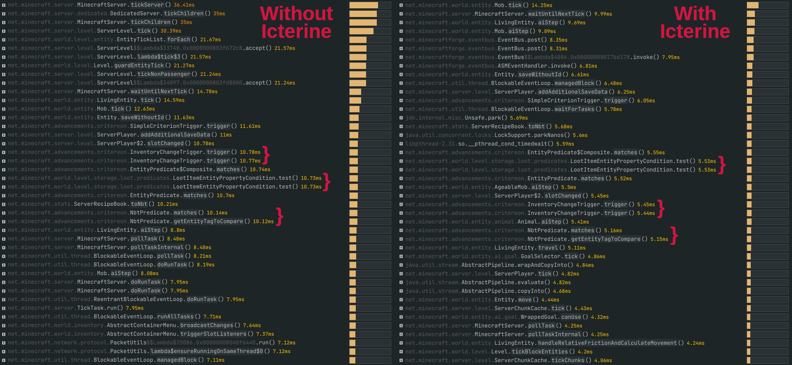

# InventoryChangeTrigger Optimization

 

## Summary

* Optimizes triggering advancements for obtaining items;
* Might break parity with vanilla, but doesn't affect vanilla advancements and shouldn't affect the vast majority of mods/datapacks;
* Even if it does affect something, advancement still should be obtainable by just dropping and picking up one of required items;
* Currently, there are no known incompatibilities or issues;
* Every injection into vanilla code can be disabled in config file.

## Results

Live test performed on dedicated server with 3 active players online, running custom Forge modpack with over 200 mods and [BlazeandCave's Advancements Pack](https://modrinth.com/datapack/blazeandcaves-advancements-pack), which adds over 950 advancements. Stats collected using Spark for one hour.

With Icterine, InventoryChangeTrigger executes almost **twice as fast**, spending about 10% of the tick time instead of 20%.

## How vanilla InventoryChangeTrigger works

1. When the game detects that stack in player inventory has changed, it calls InventoryChangeTrigger for it. This includes picking up items, dropping items, dropping whole stacks, moving items in your inventory.
   1. Also, when you open a container (chest, furnace, etc.), game thinks that all the slots in your inventory changed, and calls trigger for all of them, including empty slots.
2. InventoryChangeTrigger counts empty, non-empty and completely filled slots in your inventory. This information [could be used in advancement triggers](https://minecraft.wiki/w/Advancement/JSON_format#minecraft:inventory_changed), but is not used in vanilla.
3. InventoryChangeTrigger goes over registered advancement criteria.
4. If criterion has slot count requirements and they don't match values from step 2, or if criterion doesn't have item requirements, criterion is skipped.
5. If criterion has only one item requirement, changed stack is checked against this requirement.
6. If criterion has multiple items requirements (e.g., "Cover me with debris" requires having full netherite armor set), **every** item stack in the inventory is checked against every requirement (but fulfilled requirements get removed and are no longer checked).

## How Icterine's optimizations work

1. In step 1, do not call InventoryChangeTrigger when you drop stacks or move them out of your inventory (e.g. to chest). This is controlled by the `ignore_triggers_for_emptied_stacks` parameter in config file.
2. Similarly, do not call InventoryChangeTrigger if stack change was caused by decreasing stack but not emptying it (e.g. player dropped single item from the full stack). Controlled by `ignore_triggers_for_decreased_stacks`.
3. And also do not call InventoryChangeTrigger if stack size increased, but hasn't passed threshold for any advancement. For example, dirt stack size increased from 52 to 53, but there's no advancement for getting 53 dirt in your modpack.
3. Modify how game checks for changed items when player opens container screen, so it doesn't treat all the stack as changed the second you open anything. Controlled by `initialize_inventory_last_slots`.
4. In step 6, firstly check if changed slot matches any requirement, and only then check other stack in the inventory. Controlled by `optimize_multiple_predicate_trigger`.

Further optimizations are planned.

## Port to 1.x.x when

Icterine will be ported to mc 1.18.2 and 1.20.x. If you need port to any other version, please open issue, or ask on [Discord](https://discord.gg/2SpfwvM7dm) server.